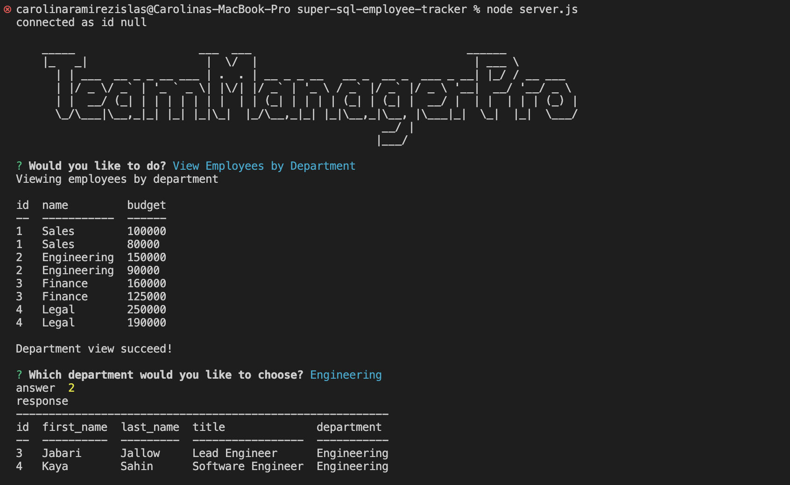

# SQL-Team-Manager-Pro

## [Description:](#description)

        SQL Team Manager Pro is a command-line application that allows you to manage your employee database efficiently. It provides various features to view, add, update, and remove employees, roles, and departments. With the help of SQL queries, the application interacts with a MySQL database, enabling you to perform common database operations.

        The application leverages several modern web technologies and frameworks to provide a rich user experience:

        JavaScript: 
        This app is built with JavaScript, the programming language of the web, which enables dynamic and interactive features.

        Node.js: 
        A JavaScript runtime environment that allows the execution of JavaScript code outside of a web browser.

        MySQL: 
        A popular open-source relational database management system used to store and retrieve data.

        Inquirer: 
        A command-line interface package for Node.js that simplifies user input by providing interactive prompts.

        Console.table: 
        A utility package that formats and displays tabular data in the console.

        dotenv: 
        A package that loads environment variables from a .env file into the application's process.env.

## [Table of Contents:](#table-of-contents:)
   
- [Description](#description)
- [Installation](#installation)
- [Usage](#usage)
- [License](#license)
- [Contributing](#contributing)
- [Tests](#tests)
- [Questions](#questions)
   
## [Installation:](#installation:)

Before you continue, ensure you have met the following requirements:

* You have installed Node.js which includes npm (Node Package Manager). If they're not, you can download and install Node.js (which includes npm) from the official website: https://nodejs.org/.

Once those are installed:

1. Clone the repository or download the code to your local machine.
2. Navigate to the directory that contains the package.json file.
3. Install the necessary dependencies: 
    
    To install the necessary dependencies, run the following command:
        
    `npm install`
    
    This command should be run in the directory that contains your package.json file, and it will install all the dependencies listed in that file.
    
4. In the root directory of the project, create a file named `.env`.

5. Open the `.env` file with a text editor and add the following lines:

    `` ` 
    DB_HOST=localhost
    DB_PORT=3306
    DB_USER=your_mysql_username
    DB_PASSWORD=your_mysql_password
    DB_NAME=your_database_name
    `` ` 

    Replace `your_mysql_username`, `your_mysql_password`, and `your_database_name` with your actual MySQL configuration values.

6. Save the `.env` file.
    
## [Usage:](#usage:)

    To use the SQL Team Manager Pro: 

1. Open a new terminal or command prompt window and run the following command  to access the MySQL shell:

    `mysql -h DB_HOST -u DB_USER -p`

    Replace `DB_HOST` with your MySQL host, `DB_USER` with your MySQL username, and -p indicates that a password will be prompted.

2. Enter your MySQL password when prompted. This is the same password you set up in your `.env` file.

3. Once you are in the MySQL shell, type the following command to select the database you want to use:

    `USE your_database_name;`

    Replace `your_database_name` with the name of the database you want to use for the application.

4. To verify that the database was selected correctly, you can run the following command to display a list of tables in the selected database:

    `SHOW TABLES;`

    You should see the tables related to the application's database schema.

5. To populate the database with the necessary schema, navigate to the directory that contains the `schema.sql` file and run the following command in the MySQL shell:

    `SOURCE path-to-schema.sql;` 

    Replace `path-to-schema.sql` with the actual path to the `schema.sql` file on your machine.

6. After executing the schema.sql file, you can populate the database with sample data (if available) by navigating to the directory that contains the seeds.sql file and running the following command in the MySQL shell:

    `SOURCE path-to-seeds.sql;` 

    Replace `path-to-seeds.sql` with the actual path to the seeds.sql file on your machine.

7. Exit the MySQL shell by typing:

    `exit;`

8. Go back to the terminal or command prompt window.

9. Run the following command to start the application:

    `node server.js`

    The application will start running, and you will see the initial prompt in the terminal or command prompt. Follow the prompts to interact with the employee database.

App in command line:

[Video Walk-through: Testing App](https://drive.google.com/file/d/1wDuSIrDgxPXbfl696ghPV5OiEHp4Ed7A/view)
If you are having issues viewing the walk-through video, download it then view it. 

    To access the Github Repository visit:
    https://github.com/CarolinaRaIs/sql-team-manager-pro

    To access the deployed site visit:
    https://carolinarais.github.io/sql-team-manager-pro/  

## [License:](#license:)

       This project is licensed under the MIT license.
   
## [Contributing:](#contributing:)

       Contributions are welcome and encouraged for this project. If you find any issues or have any suggestions for new features, please open an issue or submit a pull request. Before submitting a pull request, please ensure that your code adheres to the project's coding guidelines and has appropriate test coverage. Thank you for your interest in contributing to this project!  

       Thank you [EdenKhaos](https://github.com/EdenKhaos) for sharing your knowledge to help in the completion of this project!
   
## [Tests:](#tests:)

       I encourage contributors to thoroughly explore the code and test it to ensure its functionality. Any feedback or suggestions regarding the testing process are welcomed and appreciated.
   
## [Questions:](#questions:)

       If you have any questions about the repo you can open an issue.

**If more questions arise you can also contact CarolinaRaIs at determination28@gmail.com**
   
       
------------------------------------------------------------------------------------------------
   
This README was generated by [CarolinaRaIs](https://github.com/CarolinaRaIs)